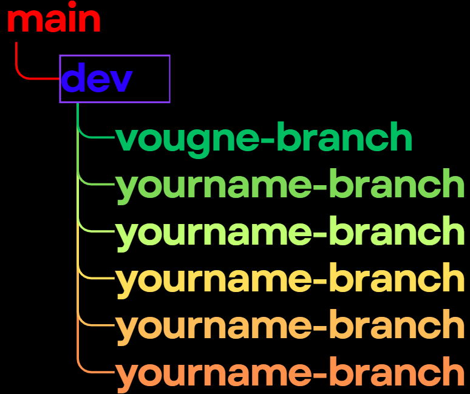

# Team Git Workflow Guide

Explanation on how we will collaborate using GitHub. It is to ensure we avoid merge conflicts and keeping our stuff cleeeaan.

---

## 📌 Overview



### How it will work
first create your own branch by:
```
git checkout -b <branch-name>
git add .
git commit -m "your message"
git push -u origin <branch-name>
```

We will have 2 important branches

The most important is the main, this is where our final project will be in its final form.

### The DEV
This is where all our branches will merge into. Dito muna tau mag merge para dto natin ma-test yung mga features natin tas saka pa natin ilalagay sa main pag ayos na sa dev branch

### Individual Branches
Each one of us will work on a specific feature. after a feature is done make sure to do the following:

```
git checkout branch-name
git fetch origin
git merge origin/dev
```

Ito ay para makuha natin yung latest sa dev branch then maayos natin agad mga conflict sa branch natin para pag mag push na tau sa dev ndi tau magka-problema sa dev branch.